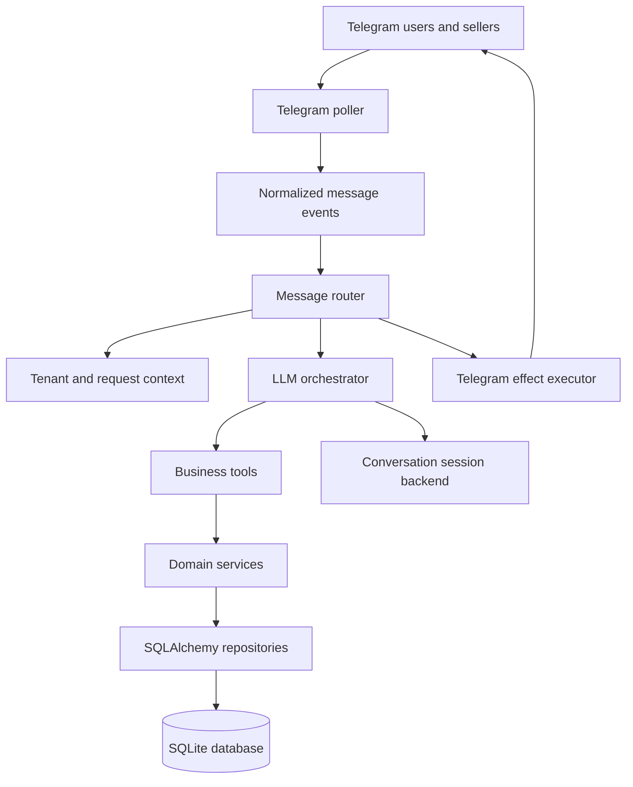

# Sale Agent Bot

An AI-powered sales assistant for Telegram-based commerce. The bot connects customers and sellers through a multi-tenant conversation workflow, uses an OpenAI-compatible LLM for intent detection and tool calling, and persists products, orders, chat history, and Telegram message bindings in a relational database.

## Highlights

- Telegram long polling with support for multiple store channels
- Buyer and seller conversation roles with separate system prompts
- LLM-driven tool calling for:
  - Product and inventory search
  - Product creation and updates for sellers
  - Order creation
  - Escalation to a human seller
- Tenant resolution per Telegram bot/channel
- Persistent chat sessions and message history
- Reply-to-message binding for seller/customer conversations
- SQLAlchemy models and Alembic migrations
- Pluggable session backends, including JSON, in-memory, database, and Redis implementations

## Architecture



The main request flow is:

1. `TelegramPoller` receives updates from Telegram.
2. The update is normalized into an internal message event.
3. `MessageRouter` resolves the tenant, user, seller, and chat session.
4. `LLMOrchestrator` selects a response or calls an available business tool.
5. Services and repositories perform the domain and database operations.
6. The Telegram adapter sends the resulting messages and UI effects.

## Project Structure

```text
src/
├── ai/                         LLM client, orchestrators, prompts, and tools
├── core/                       Settings, database, and tenant utilities
├── models/                     SQLAlchemy models and domain data classes
├── repositories/               Database access layer
├── services/                   Business services and integrations
│   ├── adapter/                Telegram and transport adapters
│   └── integrations/           Poller, events, context, and message routing
├── sessions/                   Conversation session backends
└── test/                       Integration and repository test scripts
alembic/                        Database migration environment and revisions
guide/                          Architecture and development notes
```

## Requirements

- Python 3.10 or newer
- A Telegram bot token
- An API key for an OpenAI-compatible chat-completions provider
- SQLite for the current default database configuration
- Alembic for database migrations

## Installation

Clone the repository and create a virtual environment:

```bash
git clone <your-repository-url>
cd sale_agent_bot
python -m venv .venv
```

Activate it on Windows PowerShell:

```powershell
.\.venv\Scripts\Activate.ps1
```

Activate it on macOS or Linux:

```bash
source .venv/bin/activate
```

Install the dependencies:

```bash
python -m pip install --upgrade pip
pip install -r requirements.txt
pip install alembic
```

## Configuration

Create a `.env` file in the project root:

```dotenv
GAPGPT_API_KEY=your-llm-api-key
GAPGPT_BASE_URL=https://your-openai-compatible-provider.example/v1
model=your-model-name
TELEGRAM_BOT_TOKEN=your-telegram-bot-token

# Optional
OPENAI_API_KEY=
REDIS_URL=
DATABASE_URL=
SELLER_IDS=
```

The current `src/core/db.py` configuration uses `sqlite:///./app.db`, and `alembic.ini` targets the same SQLite database. `DATABASE_URL` is loaded into settings but is not yet used to override the engine URL.

## Database Setup

Apply the existing migrations from the repository root:

```bash
alembic upgrade head
```

The Telegram poller loads bot/channel records from the database. Before starting it, make sure the relevant store and Telegram channel records exist and that the channel reference contains the Telegram bot token.

To create a new migration after changing the SQLAlchemy models:

```bash
alembic revision --autogenerate -m "describe the change"
alembic upgrade head
```

## Running the Telegram Poller

The current repository does not yet include a production `src/main.py` entrypoint. The available poller runner is `src/test/poller_test.py`:

```bash
python src/test/poller_test.py
```

It creates one polling task for each Telegram channel stored in the database. The process must be kept running to receive updates.

## Testing

The repository currently contains executable test and diagnostic scripts rather than a configured pytest suite. Run individual scripts from the project root, for example:

```bash
python src/test/dbtest.py
python src/test/repo_test.py
python src/test/llm_test.py
```

These scripts may require a configured database and valid provider credentials. Avoid running integration scripts against production data.

## Development Notes

- Keep business rules in `src/services/` and database access in `src/repositories/`.
- Add LLM-callable behavior as a tool under `src/ai/tools/` and register it in the router/orchestrator flow.
- Update the buyer and seller prompts in `src/ai/prompts/` when changing conversational behavior.
- Do not commit `.env`, API keys, bot tokens, `app.db`, or session data.
- Telegram polling requires network access to the Telegram Bot API.

## Roadmap

- Add a dedicated production entrypoint and process configuration.
- Make `DATABASE_URL` control the SQLAlchemy engine and Alembic configuration.
- Add automated unit and integration tests.
- Complete additional channel adapters such as Instagram and web transport.
- Add structured logging, health checks, and deployment documentation.

## License

No license file is currently included. Add a license before publishing the repository for reuse by others.

## توضیح فارسی

این پروژه یک دستیار فروش هوشمند و قابل توسعه برای کسب‌وکارهای مبتنی بر تلگرام است. هدف آن این است که بخش زیادی از گفتگوهای روزمره فروشگاه را به‌صورت خودکار مدیریت کند؛ از پاسخ‌گویی به سوالات مشتری درباره محصولات و موجودی گرفته تا ثبت سفارش و انتقال گفتگو به فروشنده در زمان نیاز.

### نحوه کار

ربات پیام‌های دریافتی از تلگرام را دریافت و به یک قالب داخلی تبدیل می‌کند. سپس سیستم فروشگاه، کانال، مشتری و فروشنده مرتبط با پیام را شناسایی کرده و سابقه گفت‌وگو را بارگذاری می‌کند. در مرحله بعد، مدل زبانی بر اساس نقش کاربر و prompt مربوط به همان نقش تصمیم می‌گیرد که پاسخ مستقیم بدهد یا یکی از ابزارهای کسب‌وکار را اجرا کند.

ابزارها می‌توانند برای بررسی موجودی، جستجوی محصولات، ایجاد یا ویرایش محصول، ثبت سفارش و درخواست ارتباط با فروشنده استفاده شوند. نتیجه اجرای ابزار دوباره در اختیار مدل زبانی قرار می‌گیرد تا پاسخ نهایی طبیعی و قابل فهمی برای کاربر تولید شود.

### نقش‌های سیستم

- **مشتری:** می‌تواند درباره محصولات سوال بپرسد، موجودی را بررسی کند، سفارش ثبت کند یا درخواست صحبت با فروشنده بدهد.
- **فروشنده:** می‌تواند محصولات را مدیریت کند، موجودی را تغییر دهد و به گفتگوهای ارجاع‌شده از طرف مشتری پاسخ دهد.
- **ربات:** وظیفه تشخیص درخواست، اجرای ابزار مناسب، مدیریت تاریخچه گفتگو و ارسال پاسخ را بر عهده دارد.

### معماری و ذخیره‌سازی

کد پروژه به چند لایه تقسیم شده است. لایه `services` منطق کسب‌وکار را اجرا می‌کند، لایه `repositories` مسئول ارتباط با دیتابیس است و مدل‌های SQLAlchemy ساختار داده‌هایی مانند فروشگاه، محصول، سفارش، کاربر و پیام‌های گفتگو را تعریف می‌کنند. برای مدیریت تغییرات دیتابیس نیز از Alembic استفاده شده است.

پروژه از ساختار چندمستاجری پشتیبانی می‌کند؛ بنابراین می‌توان کانال‌های مختلف تلگرام و فروشگاه‌های جداگانه را با context و داده‌های مستقل مدیریت کرد. تاریخچه گفتگو نیز از طریق session backend ذخیره می‌شود و در وضعیت فعلی، SQLite و ذخیره‌سازی JSON در دسترس هستند.

### وضعیت فعلی پروژه

اجرای فعلی بر پایه Telegram long polling و دیتابیس SQLite است. برای استفاده از پروژه باید کلید دسترسی سرویس مدل زبانی، توکن ربات تلگرام و اطلاعات اولیه فروشگاه و کانال در دیتابیس تنظیم شود. در حال حاضر پروژه بیشتر روی هسته گفتگو، ابزارهای فروش و اتصال تلگرام تمرکز دارد و برای استفاده production هنوز به entrypoint مستقل، تست‌های خودکار، logging ساختاریافته و تنظیمات کامل deployment نیاز دارد.